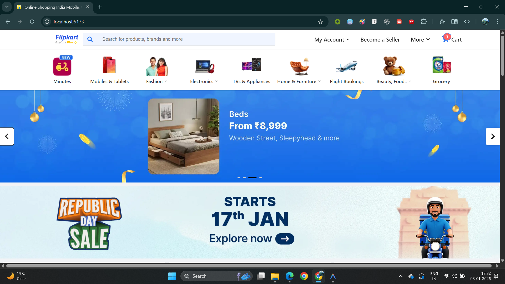
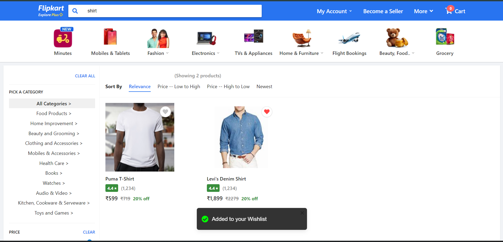
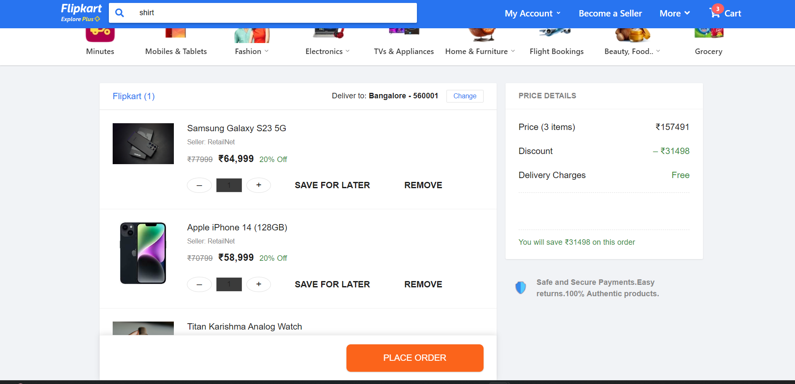

# 🛍️ Flipkart Clone


A fully functional, pixel-perfect clone of the **Flipkart** e-commerce platform. This project mimics the core functionalities and UI/UX of Flipkart, providing a seamless shopping experience from product discovery to checkout.

---
##  ⚠️ **Deployment Notice**
>
> This project is hosted on a **free-tier server**.  
> Due to cold starts, the backend may take **30–60 seconds** to respond after a period of inactivity.
>
> During this time, you may see loading indicators on the UI.
>
> **Once the server is awake, the application works smoothly with normal response times.**
>
> This behavior is related to hosting constraints and **not the application’s performance or code quality**.


----
## 🚀 Features

### 🖥️ Frontend (Client)
-   **Pixel-Perfect UI**: Closely mirrors Flipkart's authentic design language.
-   **Dynamic Homepage**: Features a responsive carousel, category strip, and categorized product sections (Top Deals, Best Quality, etc.).
-   **Advanced Search & Filtering**:
    -   Real-time search functionality.
    -   Comprehensive sidebar filters: **Category, Price (Slider + Dropdowns), Brand, Customer Ratings, Discount, Availability, and Assured badge**.
    -   Sort results by **Relevance, Price (Low/High), and Newest**.
-   **Product Details Page (PDP)**:
    -   Detailed product view with zoomable images.
    -   Specs, warranty info, and dynamic delivery offers.
    -   "Add to Cart" and "Buy Now" flows.
-   **Cart Management**:
    -   Add/Remove items, update quantities.
    -   Real-time price details (Price, Discount, Delivery Charges).
-   **Interactive Elements**: Hover effects, smooth transitions, toast notifications for actions.

### ⚙️ Backend (Server)
-   **RESTful API**: Robust Node.js/Express API handling products, cart, and users.
-   **Database**: **MySQL** with **Sequelize ORM** for structured data management.
-   **Seeding Script**: Automated database seeding with realistic mock data (Products, Categories, Images).
-   **Advanced Querying**: efficient filtering and sorting logic implementation.

---

## 🛠️ Tech Stack

| Component | Technology |
| :--- | :--- |
| **Frontend** | React.js, React Router DOM, Axios, CSS3, React Toastify, React Icons |
| **Backend** | Node.js, Express.js |
| **Database** | MySQL, Sequelize ORM |
| **Tools** | Vite, Nodemon, Git |

---

## 📸 Screenshots

| Home Page | Search Results & Filters |
| :---: | :---: |
|  |  |

| Product Detail | Cart Page |
| :---: | :---: |
|  |  |

---

## 🔧 Installation & Setup

Follow these steps to set up the project locally.

### Prerequisites
-   **Node.js** (v14 or higher)
-   **MySQL** (installed and running)

### 1. Clone the Repository
```bash
git clone https://github.com/your-username/flipkart-clone.git
cd flipkart-clone
```

### 2. Backend Setup
Navigate to the server directory and install dependencies.
```bash
cd server
npm install
```

**Database Configuration**:
1.  Open `src/config/db.js`.
2.  Update the `sequelize` instance with your MySQL credentials:
    ```javascript
    const sequelize = new Sequelize(
      "flipkart_clone", // Database Name
      "root",           // Your Username
      "YourPassword",   // Your Password
      { host: "localhost", dialect: "mysql" }
    );
    ```
3.  Create the database in MySQL Workbench/Command Line:
    ```sql
    CREATE DATABASE flipkart_clone;
    ```

**Start the Server**:
```bash
# Runs the server and seeds data automatically
npm run dev
```
*Server runs on `http://localhost:5000`*

### 3. Frontend Setup
Open a new terminal, navigate to the client directory, and install dependencies.
```bash
cd client
npm install
```

**Start the React App**:
```bash
npm run dev
```
*Client runs on `http://localhost:5173`*

---

## 🔌 API Endpoints

### Products
-   `GET /api/products`: Fetch all products (supports filtering & sorting query params).
-   `GET /api/products/:id`: Get single product details.

### Cart
-   `GET /api/cart/:userId`: Get cart items for a user.
-   `POST /api/cart/add`: Add item to cart.
-   `PUT /api/cart/update`: Update item quantity.
-   `DELETE /api/cart/remove/:itemId`: Remove item from cart.

---

## 🤝 Contributing

Contributions are welcome! Please fork the repository and create a pull request with your features or fixes.

1.  Fork the Project
2.  Create your Feature Branch (`git checkout -b feature/AmazingFeature`)
3.  Commit your Changes (`git commit -m 'Add some AmazingFeature'`)
4.  Push to the Branch (`git push origin feature/AmazingFeature`)
5.  Open a Pull Request

---


<p align="center">
  Made by <b>Shakti Priya</b>
</p>
